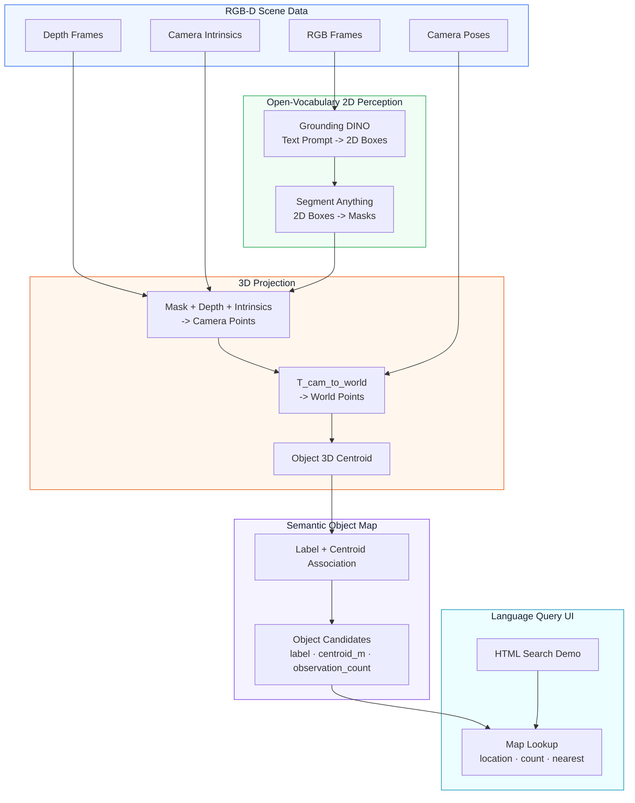

<div align="center">
  <h1>Language-Grounded 3D Object Map</h1>
  <a href="README.md">
    
  </a>
  <br><br>
  
  
  
  
  
  <p>RGB-D frames, camera poses, Grounding DINO, SAM을 활용한 language-grounded object-level semantic mapping.</p>
  
</div>

---

## 개요

**Language-Grounded 3D Object Map**은 natural-language object queries를 **metric 3D coordinates**로 변환하는 시스템이다. **Physical AI**를 위한 semantic grounding layer로 설계되었으며, legged/mobile robot이나 embodied agent가 `"go to the TV"` 또는 `"where is the chair?"` 같은 명령을 mapped indoor scene의 spatial goal로 사용할 수 있다.

RGB-D frames와 camera poses로부터 object-level semantic map을 구축한다. **Grounding DINO**는 text-specified object detection, **SAM**은 segmentation을 담당하며, depth projection은 masks를 3D object centroids로 변환한다.

```text
"Where is the chair?"
"How many tables are there?"
"What is the nearest TV from the reference point?"
```

핵심은 dense 3D reconstruction이 아니라 **language queries를 위한 object-level localization**이다. 주요 활용 범위는 object-goal navigation, indoor object search, embodied AI의 spatial memory.

---

## 시스템 아키텍처



---

## 프로젝트 로드맵

- [x] **Phase 1: Environment & Model Setup**
  - Conda `cv` 환경.
  - PyTorch CUDA, Grounding DINO, SAM, Open3D, OpenCV.
  - Grounding DINO Swin-T OGC 및 SAM ViT-B weights.
- [x] **Phase 2: ARKitScenes Scene Loading**
  - 단일 ARKitScenes 3DOD scene `41098076`.
  - RGB, depth, intrinsics, camera trajectory, GT object annotations.
- [x] **Phase 3: 2D Detection + Segmentation**
  - Grounding DINO를 이용한 text-prompt object detection.
  - SAM을 이용한 bbox-to-mask segmentation.
- [x] **Phase 4: 3D Projection + Semantic Map**
  - Mask/depth unprojection.
  - Camera-to-world transform.
  - Centroid-based object association.
- [x] **Phase 5: Evaluation**
  - Centroid-based precision, recall, localization error, duplicate rate.
  - 20-frame, 50-frame, 100-frame, keyframe ablations.
- [x] **Phase 6: Browser Query Demo**
  - Location/count/nearest query를 위한 search UI.
  - Prediction/GT top-down map toggle.
  - Nearest-object query를 위한 clickable reference point.

---

## Prerequisites

- **OS**: Ubuntu 22.04에서 테스트됨
- **Python**: 3.11
- **Conda**: 권장
- **GPU**: CUDA 지원 GPU 권장
- **Dataset**: ARKitScenes 3DOD 접근 권한
- **Models**:
  - Grounding DINO Swin-T OGC
  - SAM ViT-B

---

## 설치 및 설정

1. **저장소 클론**:

   ```bash
   git clone https://github.com/leesj24601/Language-Grounded-3D-Object-Map.git
   cd Language-Grounded-3D-Object-Map
   ```

2. **Conda 환경 생성 또는 활성화**:

   ```bash
   conda create -n cv python=3.11 -y
   conda activate cv
   ```

3. **핵심 의존성 설치**:

   사용 중인 머신에 맞는 CUDA build의 PyTorch를 설치한 뒤, pipeline에서 사용하는 나머지 packages 설치.

   ```bash
   pip install opencv-python open3d scipy transformers huggingface_hub pandas
   pip install groundingdino-py segment-anything
   ```

---

## Data & Model Weights

Expected local layout:

```text
models/
├── groundingdino/
│   ├── GroundingDINO_SwinT_OGC.py
│   └── groundingdino_swint_ogc.pth
└── sam/
    └── sam_vit_b_01ec64.pth

data/arkitscenes/3dod/Training/41098076/
├── 41098076_3dod_annotation.json
├── 41098076_3dod_mesh.ply
└── 41098076_frames/
    ├── lowres_wide/
    ├── lowres_depth/
    ├── lowres_wide_intrinsics/
    └── lowres_wide.traj
```

Experiment scene: ARKitScenes 3DOD `41098076`.

---

## 프로젝트 구조

```text
language-grounded-3d-object-map/
├── datasets/
│   └── arkitscenes_adapter.py       # ARKitScenes RGB-D/pose/GT loader
├── scripts/
│   ├── build_semantic_map_demo.py   # Multi-frame map builder
│   ├── download_data.py             # ARKitScenes download helper
│   ├── evaluate_semantic_map.py     # GT centroid evaluation
│   ├── inspect_arkitscenes_scene.py # 데이터셋 sanity check
│   ├── run_frame_grounded_sam_projection.py
│   ├── serve_query_demo.py          # Browser demo server
│   └── verify_projector.py          # Projection sanity test
├── docs/
│   ├── EXPERIMENT_LOG.md            # 상세 experiments and notes
│   ├── PROJECT_PLAN.md              # 프로젝트 계획
│   └── PROGRESS.md                  # 개발 진행 로그
├── src/
│   ├── detector.py                  # Grounding DINO wrapper
│   ├── segmentor.py                 # SAM wrapper
│   ├── projector.py                 # 2D mask -> 3D world centroid
│   ├── semantic_map.py              # Object map and association
│   └── evaluator.py                 # Precision/recall/L2 metrics
├── web/
│   └── query_demo.html              # Search UI and top-down map
```

---

## 실행 방법

> **실행 규칙**: 별도 언급이 없으면 저장소 루트에서 실행.

### 1. Semantic Object Map 구축

대표 100-frame setup을 사용하는 예시:

```bash
conda run -n cv python scripts/build_semantic_map_demo.py \
  --scene-dir data/arkitscenes/3dod/Training/41098076 \
  --frame-indices "0,8,16,24,32,40,48,56,64,72,80,88,96,104,112,120,128,137,145,153,161,169,177,185,193,201,209,217,225,233,241,249,257,265,273,281,289,297,305,313,321,329,337,345,353,361,369,377,385,393,402,410,418,426,434,442,450,458,466,474,482,490,498,506,514,522,530,538,546,554,562,570,578,586,594,602,610,618,626,634,642,650,658,667,675,683,691,699,707,715,723,731,739,747,755,763,771,779,787,795" \
  --box-threshold 0.25 \
  --text-threshold 0.35 \
  --out outputs/maps/41098076_semantic_map_100frames_text035.json
```

생성되는 semantic map JSON:

```text
outputs/maps/41098076_semantic_map_100frames_text035.json
```

### 2. Semantic Map 평가

평가에 사용할 prediction map은 `--map`으로 지정.

```bash
conda run -n cv python scripts/evaluate_semantic_map.py \
  --scene-dir data/arkitscenes/3dod/Training/41098076 \
  --map outputs/maps/41098076_semantic_map_100frames_text035.json \
  --min-observations 3 \
  --out outputs/metrics_41098076_100frames_text035_minobs3.json
```

### 3. Web Query Demo 실행

Web demo는 `web/query_demo.html`의 `MAP_PATH`에 설정된 JSON을 로드.
현재 기본값:

```text
../outputs/maps/41098076_semantic_map_100frames_text035.json
```

```bash
python3 scripts/serve_query_demo.py
```

---

## Web Query Demo

<div align="center">
  <strong>Demo Run</strong><br>
  <br>
  <a href="https://youtu.be/6Q8FwhylWOU">
    
  </a>
</div>

Local server 시작:

```bash
python3 scripts/serve_query_demo.py
```

주소:

```text
http://127.0.0.1:8000/web/query_demo.html
```

지원 query examples:

- 위치: `"Where is the chair?"`, `"의자 어딨어?"`
- 개수: `"chair count"`, `"chair 몇 개야?"`
- 근처 객체: `"nearest TV"`, `"가장 가까운 TV"`

Nearest query의 기준점은 top-down map에서 원하는 위치를 마우스로 클릭해 설정 가능.

---

## 평가 결과

<div align="center">
  
  <p><strong>Prediction vs GT Object Map</strong><br>Representative 100-frame setting의 top-down x-y centroid comparison.<br>Circles는 predictions, diamonds는 GT centroids, colors는 object labels.</p>
</div>

Representative result:

| Metric | Value |
| --- | ---: |
| **Precision@1m** | **70.37%** |
| **Recall@1m** | **63.33%** |

Additional metrics:

- Predictions / GT / matches: 27 / 30 / 19
- Mean / median L2 error: 31.13cm / 29.82cm
- Duplicate rate: 29.63%

Setting:

- Scene: ARKitScenes `41098076`
- Frames: 100 uniformly sampled frames
- Model stack: Grounding DINO Swin-T OGC + SAM ViT-B
- Thresholds: `box_threshold=0.25`, `text_threshold=0.35`
- Filter: `observation_count >= 3`

224 pose-keyframe experiment는 raw recall을 개선했지만 duplicate candidates도 증가. 현재 가장 균형 잡힌 representative result는 100-frame setting.

전체 ablation과 research-context notes는 [docs/EXPERIMENT_LOG.md](docs/EXPERIMENT_LOG.md) 참고.

---

## 평가 참고 사항

이 프로젝트의 평가는 AP/mAP 기반 3D instance segmentation보다 **centroid-based object localization**에 초점을 둔다.

Prediction은 다음 조건을 만족할 때 correct로 집계.

```text
canonical label matches
AND predicted centroid is within 1.0m of the GT centroid
```

1m threshold는 indoor object-goal navigation과 large-object search를 기준으로 설정한 값이다. GT centroid는 annotated 3D object box의 중심에 가깝고, prediction centroid는 RGB-D mask에서 depth로 투영된 visible surface 중심에 가깝다. 특히 chair, table, cabinet처럼 크기가 있거나 부분적으로만 보이는 객체는 두 중심점이 완전히 일치하기 어렵다.

따라서 이 prototype의 주요 목표는 3D mask/box overlap을 정확히 맞추는 것이 아니라, language query에 대해 usable object coordinate를 반환하는 것. AP, AP50, AP25는 full 3D instance segmentation 평가에는 유용하지만 여기서는 primary metric이 아님.

---

## Todo / Future Work

- Geometry, mask consistency, 3D extent를 활용한 object association 개선.
- Map에 아직 없는 label을 위한 query-time open-vocabulary expansion.
- Optional 3D box fitting 및 IoU-based evaluation.

---

## Acknowledgements

This project builds on:

- [Grounding DINO](https://github.com/IDEA-Research/GroundingDINO)
- [Segment Anything](https://github.com/facebookresearch/segment-anything)
- [ARKitScenes](https://github.com/apple/ARKitScenes)
- PyTorch, OpenCV, Open3D, SciPy, and related open-source tooling
