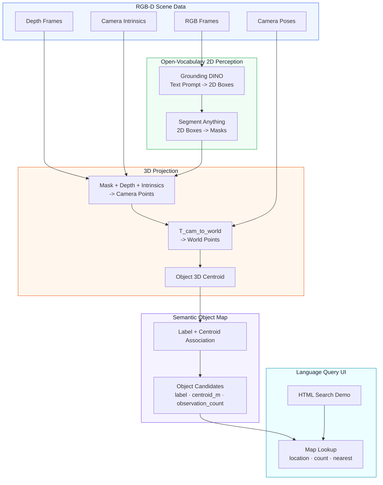
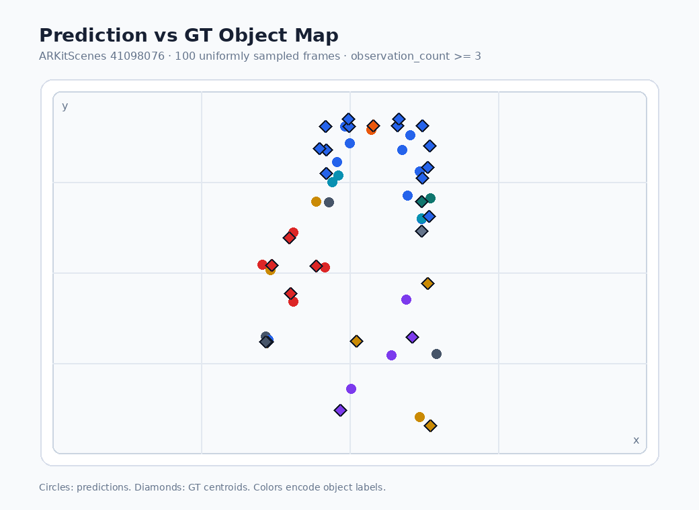

<div align="center">
  <h1>Language-Grounded 3D Object Map</h1>
  <a href="README.ko.md">
    
  </a>
  <br><br>
  
  
  
  
  
  <p>Language-grounded object-level semantic mapping from RGB-D frames, camera poses, Grounding DINO, and SAM.</p>
  
</div>

---

## Overview

**Language-Grounded 3D Object Map** turns natural-language object queries into **metric 3D coordinates**. It is designed as a semantic grounding layer for **Physical AI**: a legged robot, mobile robot, or embodied agent can use commands like `"go to the TV"` or `"where is the chair?"` as spatial goals in a mapped indoor scene.

The system builds an object-level semantic map from RGB-D frames and camera poses. **Grounding DINO** detects text-specified objects, **SAM** segments them, and depth projection converts those masks into 3D object centroids.

```text
"Where is the chair?"
"How many tables are there?"
"What is the nearest TV from the reference point?"
```

The focus is not dense 3D reconstruction. The focus is **object-level localization for language queries**, with applications in object-goal navigation, indoor object search, and spatial memory for embodied AI.

---

## System Architecture



---

## Project Roadmap

- [x] **Phase 1: Environment & Model Setup**
  - Conda `cv` environment.
  - PyTorch CUDA, Grounding DINO, SAM, Open3D, OpenCV.
  - Grounding DINO Swin-T OGC and SAM ViT-B weights.
- [x] **Phase 2: ARKitScenes Scene Loading**
  - Single ARKitScenes 3DOD scene `41098076`.
  - RGB, depth, intrinsics, camera trajectory, and GT object annotations.
- [x] **Phase 3: 2D Detection + Segmentation**
  - Text-prompt object detection with Grounding DINO.
  - Bbox-to-mask segmentation with SAM.
- [x] **Phase 4: 3D Projection + Semantic Map**
  - Mask/depth unprojection.
  - Camera-to-world transform.
  - Centroid-based object association.
- [x] **Phase 5: Evaluation**
  - Centroid-based precision, recall, localization error, duplicate rate.
  - 20-frame, 50-frame, 100-frame, and keyframe ablations.
- [x] **Phase 6: Browser Query Demo**
  - Search UI for location/count/nearest queries.
  - Top-down prediction/GT map toggle.
  - Clickable reference point for nearest-object queries.

---

## Prerequisites

- **OS**: Ubuntu 22.04 tested
- **Python**: 3.11
- **Conda**: recommended
- **GPU**: CUDA-capable GPU recommended
- **Dataset**: ARKitScenes 3DOD access
- **Models**:
  - Grounding DINO Swin-T OGC
  - SAM ViT-B

---

## Installation & Setup

1. **Clone the repository**:

   ```bash
   git clone https://github.com/leesj24601/Language-Grounded-3D-Object-Map.git
   cd Language-Grounded-3D-Object-Map
   ```

2. **Create or activate the conda environment**:

   ```bash
   conda create -n cv python=3.11 -y
   conda activate cv
   ```

3. **Install core dependencies**:

   Install PyTorch with the CUDA build appropriate for your machine, then install the remaining packages used by the pipeline:

   ```bash
   pip install opencv-python open3d scipy transformers huggingface_hub pandas
   pip install groundingdino-py segment-anything
   ```

---

## Data & Model Weights

Expected local layout:

```text
models/
├── groundingdino/
│   ├── GroundingDINO_SwinT_OGC.py
│   └── groundingdino_swint_ogc.pth
└── sam/
    └── sam_vit_b_01ec64.pth

data/arkitscenes/3dod/Training/41098076/
├── 41098076_3dod_annotation.json
├── 41098076_3dod_mesh.ply
└── 41098076_frames/
    ├── lowres_wide/
    ├── lowres_depth/
    ├── lowres_wide_intrinsics/
    └── lowres_wide.traj
```

Experiment scene: ARKitScenes 3DOD `41098076`.

---

## Project Structure

```text
language-grounded-3d-object-map/
├── datasets/
│   └── arkitscenes_adapter.py       # ARKitScenes RGB-D/pose/GT loader
├── scripts/
│   ├── build_semantic_map_demo.py   # Multi-frame map builder
│   ├── download_data.py             # ARKitScenes download helper
│   ├── evaluate_semantic_map.py     # GT centroid evaluation
│   ├── inspect_arkitscenes_scene.py # Dataset sanity check
│   ├── run_frame_grounded_sam_projection.py
│   ├── serve_query_demo.py          # Browser demo server
│   └── verify_projector.py          # Projection sanity test
├── docs/
│   ├── EXPERIMENT_LOG.md            # Detailed experiments and notes
│   ├── PROJECT_PLAN.md              # Project plan
│   └── PROGRESS.md                  # Development progress log
├── src/
│   ├── detector.py                  # Grounding DINO wrapper
│   ├── segmentor.py                 # SAM wrapper
│   ├── projector.py                 # 2D mask -> 3D world centroid
│   ├── semantic_map.py              # Object map and association
│   └── evaluator.py                 # Precision/recall/L2 metrics
├── web/
│   └── query_demo.html              # Search UI and top-down map
```

---

## How to Run

> **Execution rule**: Run commands from the repository root unless noted otherwise.

### 1. Build the Semantic Object Map

Example using the representative 100-frame setup:

```bash
conda run -n cv python scripts/build_semantic_map_demo.py \
  --scene-dir data/arkitscenes/3dod/Training/41098076 \
  --frame-indices "0,8,16,24,32,40,48,56,64,72,80,88,96,104,112,120,128,137,145,153,161,169,177,185,193,201,209,217,225,233,241,249,257,265,273,281,289,297,305,313,321,329,337,345,353,361,369,377,385,393,402,410,418,426,434,442,450,458,466,474,482,490,498,506,514,522,530,538,546,554,562,570,578,586,594,602,610,618,626,634,642,650,658,667,675,683,691,699,707,715,723,731,739,747,755,763,771,779,787,795" \
  --box-threshold 0.25 \
  --text-threshold 0.35 \
  --out outputs/maps/41098076_semantic_map_100frames_text035.json
```

Generated semantic map JSON:

```text
outputs/maps/41098076_semantic_map_100frames_text035.json
```

### 2. Evaluate the Semantic Map

Specify the prediction map to evaluate with `--map`.

```bash
conda run -n cv python scripts/evaluate_semantic_map.py \
  --scene-dir data/arkitscenes/3dod/Training/41098076 \
  --map outputs/maps/41098076_semantic_map_100frames_text035.json \
  --min-observations 3 \
  --out outputs/metrics_41098076_100frames_text035_minobs3.json
```

### 3. Run the Web Query Demo

The web demo loads the JSON configured by `MAP_PATH` in `web/query_demo.html`.
Current default:

```text
../outputs/maps/41098076_semantic_map_100frames_text035.json
```

```bash
python3 scripts/serve_query_demo.py
```

---

## Web Query Demo

<div align="center">
  <strong>Demo Run</strong><br>
  <br>
  <a href="https://youtu.be/6Q8FwhylWOU">
    
  </a>
</div>

Start the local server:

```bash
python3 scripts/serve_query_demo.py
```

The script prints and opens:

```text
http://127.0.0.1:8000/web/query_demo.html
```

Supported query types:

- Location: `"Where is the chair?"`, `"의자 어딨어?"`
- Count: `"chair count"`, `"chair 몇 개야?"`
- Nearest object: `"nearest TV"`, `"가장 가까운 TV"`

For nearest-object queries, the reference point can be set by clicking a location on the top-down map.

---

## Evaluation Results

<div align="center">
  
  <p><strong>Prediction vs GT Object Map</strong><br>Top-down x-y centroid comparison for the representative 100-frame setting.<br>Circles are predictions, diamonds are GT centroids, and colors encode object labels.</p>
</div>

Representative result:

| Metric | Value |
| --- | ---: |
| **Precision@1m** | **70.37%** |
| **Recall@1m** | **63.33%** |

Additional metrics:

- Predictions / GT / matches: 27 / 30 / 19
- Mean / median L2 error: 31.13cm / 29.82cm
- Duplicate rate: 29.63%

Setting:

- Scene: ARKitScenes `41098076`
- Frames: 100 uniformly sampled frames
- Model stack: Grounding DINO Swin-T OGC + SAM ViT-B
- Thresholds: `box_threshold=0.25`, `text_threshold=0.35`
- Filter: `observation_count >= 3`

The 224 pose-keyframe experiment improved raw recall but increased duplicate candidates. The 100-frame setting is currently the best balanced representative result.

See [docs/EXPERIMENT_LOG.md](docs/EXPERIMENT_LOG.md) for full ablations and research-context notes.

---

## Evaluation Notes

This project uses **centroid-based object localization** rather than AP/mAP-based 3D instance segmentation.

A prediction is counted as correct if:

```text
canonical label matches
AND predicted centroid is within 1.0m of the GT centroid
```

The 1m threshold is chosen for indoor object-goal navigation and large-object search. The GT centroid is close to the center of the annotated 3D object box, while the predicted centroid is closer to the visible surface center projected from an RGB-D mask. For objects such as chairs, tables, and cabinets, especially when only partially visible, these two centers are not expected to match exactly.

The primary goal of this prototype is not exact 3D mask/box overlap. The goal is to return a usable object coordinate for a language query. AP, AP50, and AP25 are useful for full 3D instance segmentation, but they are not the primary metric here.

---

## Todo / Future Work

- Improve object association using geometry, mask consistency, and 3D extent.
- Add query-time open-vocabulary expansion for labels not already in the map.
- Add optional 3D box fitting and IoU-based evaluation.

---

## Acknowledgements

This project builds on:

- [Grounding DINO](https://github.com/IDEA-Research/GroundingDINO)
- [Segment Anything](https://github.com/facebookresearch/segment-anything)
- [ARKitScenes](https://github.com/apple/ARKitScenes)
- PyTorch, OpenCV, Open3D, SciPy, and related open-source tooling
