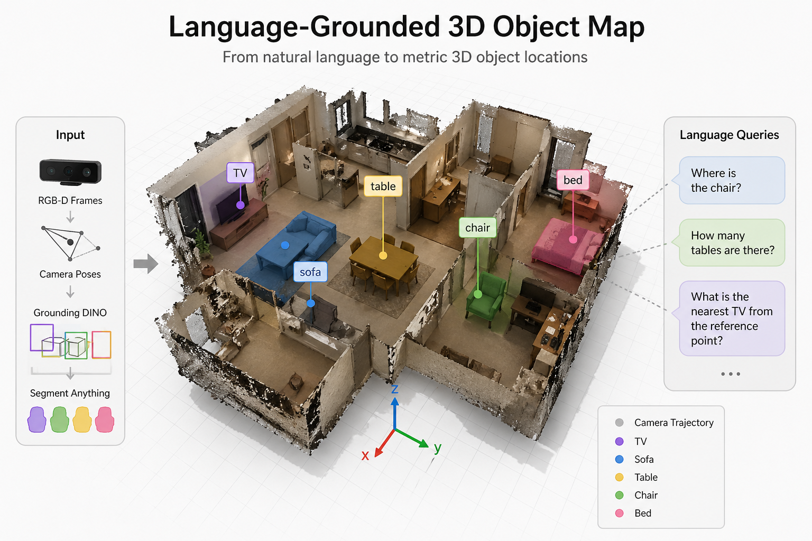
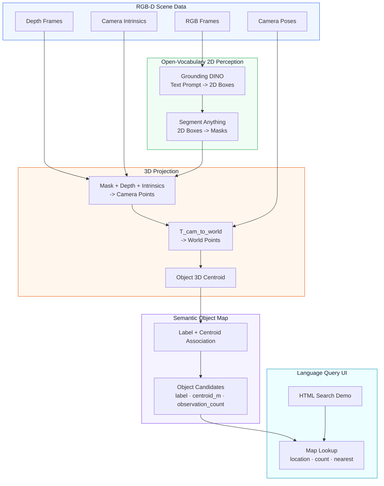
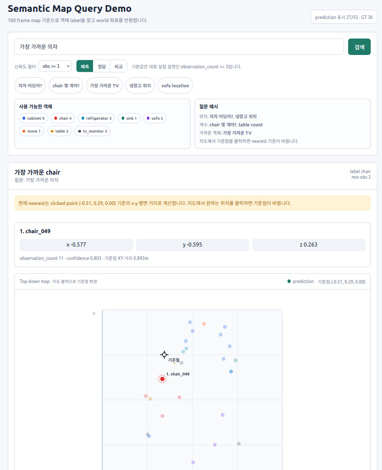

<div align="center">
  <h1>Language-Grounded 3D Object Map</h1>
  
  
  
  
  
  <p>Language-grounded object-level semantic mapping from RGB-D frames, camera poses, Grounding DINO, and SAM.</p>
  
</div>

---

## Overview

**Language-Grounded 3D Object Map** turns natural-language object queries into **metric 3D coordinates**. It is designed as a semantic grounding layer for **Physical AI**: a legged robot, mobile robot, or embodied agent can use commands like `"go to the TV"` or `"where is the chair?"` as spatial goals in a mapped indoor scene.

The system builds an object-level semantic map from RGB-D frames and camera poses. **Grounding DINO** detects text-specified objects, **SAM** segments them, and depth projection converts those masks into 3D object centroids.

```text
"Where is the chair?"
"How many tables are there?"
"What is the nearest TV from the reference point?"
```

The focus is not dense 3D reconstruction. The focus is **object-level localization for language queries**, with applications in object-goal navigation, indoor object search, and spatial memory for embodied AI.

---

## Table of Contents

- [Overview](#overview)
- [System Architecture](#system-architecture)
- [Project Roadmap](#project-roadmap)
- [Prerequisites](#prerequisites)
- [Installation & Setup](#installation--setup)
- [Data & Model Weights](#data--model-weights)
- [Project Structure](#project-structure)
- [How to Run](#how-to-run)
- [Web Query Demo](#web-query-demo)
- [Evaluation Results](#evaluation-results)
- [Evaluation Notes](#evaluation-notes)
- [Acknowledgements](#acknowledgements)

---

## System Architecture



---

## Project Roadmap

- [x] **Phase 1: Environment & Model Setup**
  - Conda `cv` environment.
  - PyTorch CUDA, Grounding DINO, SAM, Open3D, OpenCV.
  - Grounding DINO Swin-T OGC and SAM ViT-B weights.
- [x] **Phase 2: ARKitScenes Scene Loading**
  - Single ARKitScenes 3DOD scene `41098076`.
  - RGB, depth, intrinsics, camera trajectory, and GT object annotations.
- [x] **Phase 3: 2D Detection + Segmentation**
  - Text-prompt object detection with Grounding DINO.
  - Bbox-to-mask segmentation with SAM.
- [x] **Phase 4: 3D Projection + Semantic Map**
  - Mask/depth unprojection.
  - Camera-to-world transform.
  - Centroid-based object association.
- [x] **Phase 5: Evaluation**
  - Centroid-based precision, recall, localization error, duplicate rate.
  - 20-frame, 50-frame, 100-frame, and keyframe ablations.
- [x] **Phase 6: Browser Query Demo**
  - Search UI for location/count/nearest queries.
  - Top-down prediction/GT map toggle.
  - Clickable reference point for nearest-object queries.
- [ ] **Phase 7: Future Improvements**
  - Better object association using geometry, mask consistency, and 3D extent.
  - Query-time open-vocabulary expansion for labels not already in the map.
  - Optional 3D box fitting and IoU-based evaluation.

---

## Prerequisites

- **OS**: Ubuntu 22.04 tested
- **Python**: 3.11
- **Conda**: recommended
- **GPU**: CUDA-capable GPU recommended
- **Dataset**: ARKitScenes 3DOD access
- **Models**:
  - Grounding DINO Swin-T OGC
  - SAM ViT-B

The repository intentionally does **not** track large datasets, model checkpoints, or generated outputs.

---

## Installation & Setup

1. **Clone the repository**:

   ```bash
   git clone https://github.com/<your-username>/language-grounded-3d-object-map.git
   cd language-grounded-3d-object-map
   ```

2. **Create or activate the conda environment**:

   ```bash
   conda create -n cv python=3.11 -y
   conda activate cv
   ```

3. **Install core dependencies**:

   Install PyTorch with the CUDA build appropriate for your machine, then install the remaining packages used by the pipeline:

   ```bash
   pip install opencv-python open3d scipy transformers huggingface_hub pandas
   pip install groundingdino-py segment-anything
   ```

4. **Verify imports**:

   ```bash
   python - <<'PY'
   import torch, cv2, open3d, groundingdino, segment_anything
   print("torch:", torch.__version__, "cuda:", torch.cuda.is_available())
   print("opencv:", cv2.__version__)
   PY
   ```

---

## Data & Model Weights

Large files are ignored by Git:

```text
data/
external/
models/
outputs/
```

Expected local paths:

```text
models/
├── groundingdino/
│   ├── GroundingDINO_SwinT_OGC.py
│   └── groundingdino_swint_ogc.pth
└── sam/
    └── sam_vit_b_01ec64.pth

data/arkitscenes/3dod/Training/41098076/
├── 41098076_3dod_annotation.json
├── 41098076_3dod_mesh.ply
└── 41098076_frames/
    ├── lowres_wide/
    ├── lowres_depth/
    ├── lowres_wide_intrinsics/
    └── lowres_wide.traj
```

The selected experiment scene is ARKitScenes 3DOD scene `41098076`.

---

## Project Structure

```text
language-grounded-3d-object-map/
├── datasets/
│   └── arkitscenes_adapter.py       # ARKitScenes RGB-D/pose/GT loader
├── scripts/
│   ├── build_semantic_map_demo.py   # Multi-frame map builder
│   ├── evaluate_semantic_map.py     # GT centroid evaluation
│   ├── inspect_arkitscenes_scene.py # Dataset sanity check
│   ├── run_frame_grounded_sam_projection.py
│   ├── serve_query_demo.py          # Browser demo server
│   └── verify_projector.py          # Projection sanity test
├── src/
│   ├── detector.py                  # Grounding DINO wrapper
│   ├── segmentor.py                 # SAM wrapper
│   ├── projector.py                 # 2D mask -> 3D world centroid
│   ├── semantic_map.py              # Object map and association
│   └── evaluator.py                 # Precision/recall/L2 metrics
├── web/
│   └── query_demo.html              # Search UI and top-down map
├── EXPERIMENT_LOG.md                # Detailed experiments and notes
├── PROJECT_PLAN.md                  # Project plan
└── PROGRESS.md                      # Development progress log
```

---

## How to Run

> **Execution rule**: Run commands from the repository root unless noted otherwise.

### 1. Inspect the selected ARKitScenes scene

```bash
conda run -n cv python scripts/inspect_arkitscenes_scene.py \
  --scene-dir data/arkitscenes/3dod/Training/41098076 \
  --frame-index 300
```

### 2. Verify 2D mask to 3D projection

```bash
conda run -n cv python scripts/verify_projector.py \
  --scene-dir data/arkitscenes/3dod/Training/41098076 \
  --frame-index 300
```

### 3. Run one-frame Grounding DINO + SAM + 3D projection

```bash
conda run -n cv python scripts/run_frame_grounded_sam_projection.py \
  --scene-dir data/arkitscenes/3dod/Training/41098076 \
  --frame-index 300 \
  --box-threshold 0.22 \
  --text-threshold 0.22
```

### 4. Build a semantic object map

Example using the representative 100-frame setup:

```bash
conda run -n cv python scripts/build_semantic_map_demo.py \
  --scene-dir data/arkitscenes/3dod/Training/41098076 \
  --frame-indices "0,8,16,24,32,40,48,56,64,72,80,88,96,104,112,120,128,137,145,153,161,169,177,185,193,201,209,217,225,233,241,249,257,265,273,281,289,297,305,313,321,329,337,345,353,361,369,377,385,393,402,410,418,426,434,442,450,458,466,474,482,490,498,506,514,522,530,538,546,554,562,570,578,586,594,602,610,618,626,634,642,650,658,667,675,683,691,699,707,715,723,731,739,747,755,763,771,779,787,795" \
  --box-threshold 0.25 \
  --text-threshold 0.35 \
  --out outputs/maps/41098076_semantic_map_100frames_text035.json
```

### 5. Evaluate the semantic map

```bash
conda run -n cv python scripts/evaluate_semantic_map.py \
  --scene-dir data/arkitscenes/3dod/Training/41098076 \
  --map outputs/maps/41098076_semantic_map_100frames_text035.json \
  --min-observations 3 \
  --out outputs/metrics_41098076_100frames_text035_minobs3.json
```

---

## Web Query Demo

<div align="center">
  <table>
    <tr>
      <td align="center">
        <strong>Query UI</strong><br>
        
      </td>
      <td align="center">
        <strong>Demo Run</strong><br>
        
      </td>
    </tr>
  </table>
</div>

Start the local server:

```bash
python3 scripts/serve_query_demo.py
```

The script prints and opens:

```text
http://127.0.0.1:8000/web/query_demo.html
```

Supported query types:

```text
"Where is the chair?"
"chair count"
"nearest TV"
"의자 어딨어?"
"chair 몇 개야?"
"가장 가까운 TV"
```

UI features:

- object label guide with current visible counts
- `observation_count` confidence filter
- prediction / GT / comparison map toggle
- top-down object map
- clickable reference point for nearest-object queries

---

## Evaluation Results

Representative result:

```text
Scene: 41098076
Frames: 100 uniformly sampled frames
Model stack: Grounding DINO Swin-T OGC + SAM ViT-B
Thresholds: box_threshold=0.25, text_threshold=0.35
Filter: observation_count >= 3

Predictions: 27
GT objects: 30
Matches: 19
Precision@1m: 70.37%
Recall@1m: 63.33%
Mean L2 localization error: 31.13cm
Median L2 localization error: 29.82cm
Duplicate rate: 29.63%
```

The 224 pose-keyframe experiment improved raw recall but increased duplicate candidates. The 100-frame setting is currently the best balanced representative result.

See [EXPERIMENT_LOG.md](EXPERIMENT_LOG.md) for full ablations and research-context notes.

---

## Evaluation Notes

This project uses **centroid-based object localization** rather than AP/mAP-based 3D instance segmentation.

A prediction is counted as correct if:

```text
canonical label matches
AND predicted centroid is within 1.0m of the GT centroid
```

This is intentional. The project goal is not pixel-perfect or volume-perfect segmentation. The goal is to return useful object coordinates for language queries and robot/object-goal style applications.

AP, AP50, and AP25 are stricter metrics that evaluate 3D mask/box overlap and confidence ranking. They are useful for full 3D instance segmentation, but they are not the primary target of this prototype.

---

## Acknowledgements

This project builds on:

- [Grounding DINO](https://github.com/IDEA-Research/GroundingDINO)
- [Segment Anything](https://github.com/facebookresearch/segment-anything)
- [ARKitScenes](https://github.com/apple/ARKitScenes)
- PyTorch, OpenCV, Open3D, SciPy, and related open-source tooling
