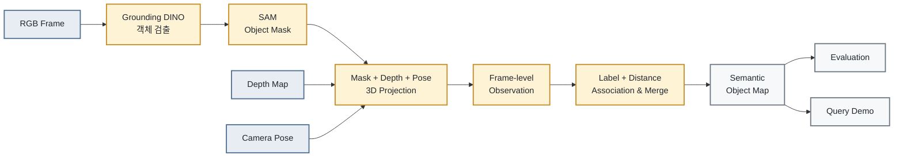

# Notion Mermaid Pipeline Implementation Plan

> **For agentic workers:** REQUIRED SUB-SKILL: Use superpowers:subagent-driven-development (recommended) or superpowers:executing-plans to implement this plan task-by-task. Steps use checkbox (`- [ ]`) syntax for tracking.

**Goal:** Notion의 기존 일렬 파이프라인을 입력 의존성이 정확한 분기·합류형 Mermaid 다이어그램으로 교체한다.

**Architecture:** Notion 페이지를 재조회해 기존 8단계 블록을 정확히 찾고 `update_content`로 해당 영역만 교체한다. Mermaid는 RGB 처리 경로와 Depth/Pose 입력을 Projection에서 합류시키고, Semantic Map 이후 Evaluation과 Query Demo로 분기한다.

**Tech Stack:** Notion MCP enhanced Markdown, Mermaid `flowchart LR`

## Global Constraints

- `## 3. 전체 파이프라인`의 기존 화살표 목록만 교체한다.
- `### 데이터 흐름`과 이후 모든 섹션은 유지한다.
- 입력·처리·결과 노드는 색상과 테두리를 함께 사용해 구분한다.
- 다른 Notion 블록과 저장소 소스 코드는 변경하지 않는다.

---

### Task 1: Mermaid 파이프라인 표적 교체 및 검증

**Files:**
- Modify externally: Notion page `353c937eac2f80e0ad68dca916b46df5`

**Interfaces:**
- Consumes: 기존 `## 3. 전체 파이프라인` 화살표 목록
- Produces: Mermaid code block과 보존된 `### 데이터 흐름` 설명

- [ ] **Step 1: Notion Markdown 사양과 현재 페이지 재조회**

`notion://docs/enhanced-markdown-spec`과 대상 페이지를 가져와 기존 교체 문자열이 정확히 한 번 존재하는지 확인한다.

- [ ] **Step 2: 기존 목록을 Mermaid 블록으로 교체**

````markdown

````

- [ ] **Step 3: 페이지 재조회 검증**

다음을 모두 확인한다.

- Mermaid 언어 코드 블록 1개
- `SAM --> PROJ`, `DEPTH --> PROJ`, `POSE --> PROJ` 합류 3개
- `MAP --> EVAL`, `MAP --> QUERY` 분기 2개
- 기존 화살표 목록 부재
- `### 데이터 흐름`, RGB·Depth·Camera Pose·핵심 변환 설명 존재
- `## 4. 데이터셋과 객체 Vocabulary` 이후 내용 유지

- [ ] **Step 4: 저장소 상태 확인**

Run: `git status --short`
Expected: 계획 밖 파일이나 수정이 없다.
